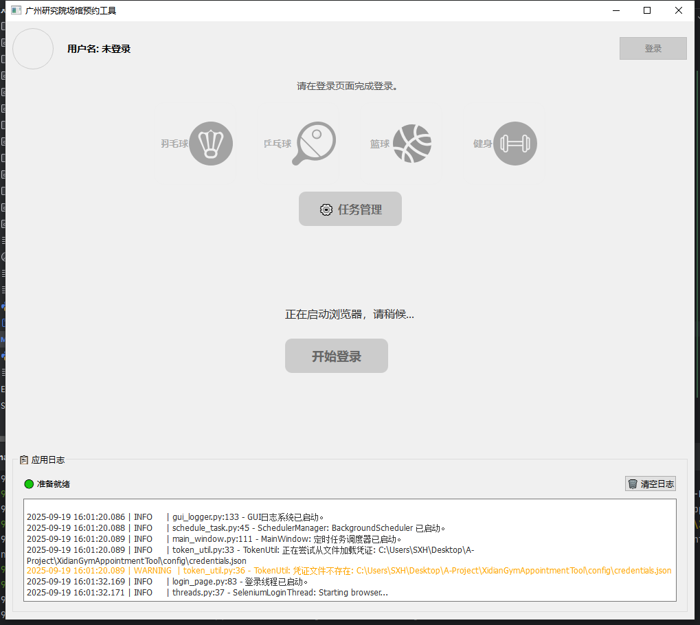
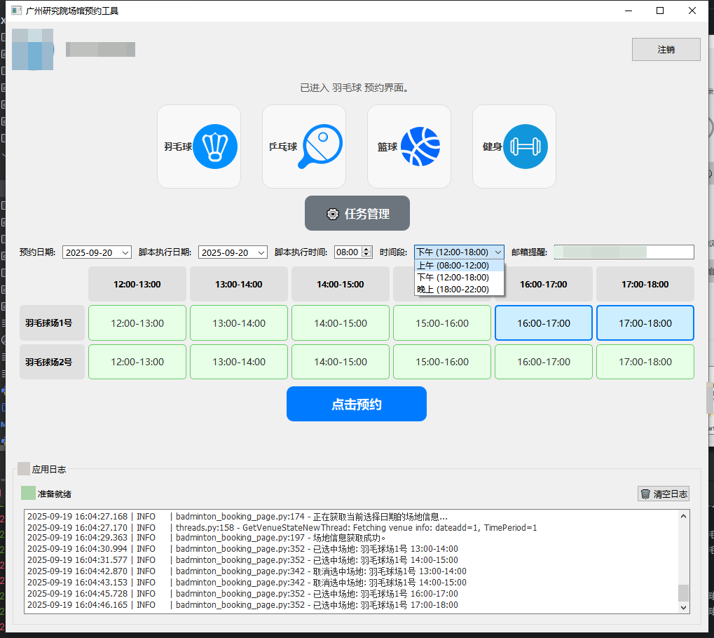

# 实现思路

内嵌官方的登陆，用户提前登陆之后，Tool 自动获取登陆后的所有相关凭证。


通过凭证调用 API 接口

# 项目启动
使用使用uv管理项目依赖
## 安装uv（如果安装了可以跳过）
windwos 安装uv
```powershell
powershell -ExecutionPolicy ByPass -c "irm https://astral.sh/uv/install.ps1 | iex"
```

macOs, Linux 安装uv：
```powershell
curl -LsSf https://astral.sh/uv/install.sh | sh
```

## 创建虚拟环境

```powershell
uv venv
```

## 激活虚拟环境

linux,macOs:
```powershell
source .venv/bin/activate
```
windows:
```powershell
.venv\Scripts\activate
```

## 安装依赖

```powershell
uv syncW
## 创建.env.local
必须在根目录下创建一个 `.env.local` 文件！！！！！！！！！！！！！

copy `.env` 的配置文件
如果无需邮箱提醒无需修改，如果需要请填写你的 `EMAIL_SENDER_EMAIL`和 `EMAIL_SENDER_PASSWORD` 即可


## 启动项目！！

```powershell
uv run main.py
```

# 项目使用
## 登陆
需要点击界面中心的登陆，跳转至官网进行登陆。 

## 使用
首先选择你要预订的日期，再设置什么时候开始抢，选择场地，点击提交即可。

可以设置提醒邮箱用于通知是否成功抢到。


## 撤销任务
点击 **任务管理** 可以撤销查看抢票任务

# 已知问题
1. 未解决8点抢票前的强制二次登陆，需要接近抢票时间时进行登陆。
2. 此脚本没有云端服务不能关闭本脚本。
